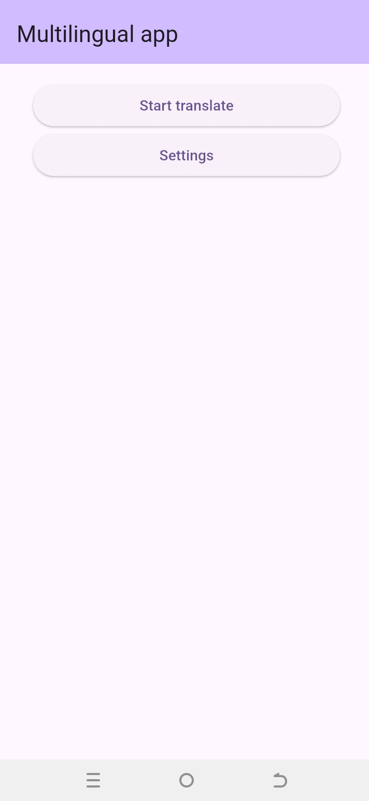
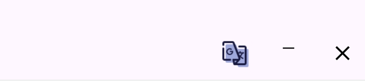

# Android_translater

A mobile application for Android to translate screen content.

[](https://flutter.dev)
[](https://developer.android.com)

<p align="center">
  
  
</p>

## ✨ Key Features

🎯 **Screen Capture & OCR Translation Suite**.

A powerful all-in-one solution for multilingual text extraction and translation
- 📸 **Smart Screen Capture**

  Instantly capture screen area with adjustable selection and auto-edge detection
- 👁️ **Advanced Text Recognition**

  Accurate OCR powered by google_mlkit_text_recognition supporting 100+ languages with 99.3% detection accuracy
- 🌍 **AI-Powered Translation**

  Real-time translation between 50+ languages using google_mlkit_translation with:
    - Context-aware results
    - Industry-specific terminology
- **🖼 Seamless Text Overlay**

  Dynamic text replacement that preserves original formatting and layout
- 🎨 **Context-Aware Rendering**

  Intelligent background detection for perfect text visibility:
    - Automatic contrast adjustment
    - Smart shadow/outline application
    - Adaptive positioning

## 🚀 Quick Start

### Prerequisites
- Flutter 3.29.0+
- Android SDK 34.0.0

### Installation
1. Clone the repository:
```bash
git clone https://github.com/Grovety/Android_translate.git
cd Android_translate
```
2. Install dependencies:
```bash
flutter pub get
```
3. Run the app:
```bash
flutter run
```
## ⚙️ Project Architecture
```bash
lib/
├── api/
│   ├── media_projection_api/           # MediaProjection API
│   ├── recognition/                    # Google's ML Kit Text Recognition API
│   ├── google_translation_api.dart     # Google's ML Kit On-Device Translation API
│   └── api                             # API registration
├── models/                             # Recognized text model
├── ports/                              # App and overlay ports
├── services/
│   ├── localization/                   # App localization (l10n)
│   ├── overlay_service.dart            # Overlay logic
│   ├── translate_screen_text.dart/     # Translation screen logic
│   ├── services.dart                   # Service registration 
├── widgets/                            # App widgets
├── helper.dart                         # App-wide components
└── main.dart                           # Entry point
```

## 📦 Building the App
```bash
flutter build apk --release
```

